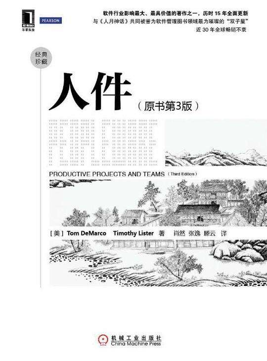

# Peopleware-zh

《人件(原书第 3 版)》

在线阅读：[http://gdut_yy.gitee.io/doc-pw/](http://gdut_yy.gitee.io/doc-pw/)



## 目录

- [第一部分 管理人力资源](docs/part1.md)
- [01 此时此刻，一个项目正在走向失败](docs/ch1.md)
- [02 干酪汉堡，做一个，卖一个](docs/ch2.md)
- [03 维也纳在等你](docs/ch3.md)
- [04 质量——如果时间允许](docs/ch4.md)
- [05 再谈帕金森定律](docs/ch5.md)
- [06 苦杏素](docs/ch6.md)

---

- [第二部分 办公环境](docs/part2.md)
- [07 家具警察](docs/ch7.md)
- [08 “朝九晚五在这里啥也完成不了。”](docs/ch8.md)
- [09 在空间上省钱](docs/ch9.md)
- [问奏曲：生产效率度量和不明飞行物](docs/ch9b.md)
- [10 大脑时间与身体时间](docs/ch10.md)
- [11 电话](docs/ch11.md)
- [12 门的回归](docs/ch12.md)
- [13 采取保护步骤](docs/ch13.md)

---

- [第三部分 正确的人](docs/part3.md)
- [14 霍恩布洛尔因素](docs/ch14.md)
- [15 谈谈领导力](docs/ch15.md)
- [16 雇一名杂耍演员](docs/ch16.md)
- [17 与他人良好合作](docs/ch17.md)
- [18 童年的终结](docs/ch18.md)
- [19 在这儿很开心](docs/ch19.md)
- [20 人力资本](docs/ch20.md)

---

- [第四部分 高效团队养成](docs/part4.md)
- [21 整体大于部分之和](docs/ch21.md)
- [22 黑衣团队](docs/ch22.md)
- [23 团队自毁](docs/ch23.md)
- [24 再谈团队自毁](docs/ch24.md)
- [25 竞争](docs/ch25.md)
- [26 一顿意面晚餐](docs/ch26.md)
- [27 敞开和服](docs/ch27.md)
- [28 团队形成的化学反应](docs/ch28.md)

---

- [第五部分 沃土](docs/part5.md)
- [29 自我愈复系统](docs/ch29.md)
- [30 与风险共舞](docs/ch30.md)
- [31 会议、独白和交流](docs/ch31.md)
- [32 终极管理罪恶得主是……](docs/ch32.md)
- [33 “邪恶”电邮](docs/ch33.md)
- [34 让改变成为可能](docs/ch34.md)
- [35 组织型学习](docs/ch35.md)
- [36 构建社区](docs/ch36.md)

---

- [第六部分 快乐地工作](docs/part6.md)
- [37 混乱与秩序](docs/ch37.md)
- [38 自由电子](docs/ch38.md)
- [39 霍尔加·丹斯克](docs/ch39.md)

## 本地开发 & 阅读

本项目基于 vuepress 进行开发，以提供比 github mardown 更佳的阅读体验

依赖于 `node.js`、`yarn`、`vuepress` 等环境

```sh
# vuepress
yarn global add vuepress

# 本地开发
git clone https://github.com/gdut-yy/Peopleware-zh.git
cd Peopleware-zh/
yarn docs:dev
```

## 更多书籍

[https://github.com/xx-zh/xx-zh-roadmap](https://github.com/xx-zh/xx-zh-roadmap)

## License

[MIT](./LICENSE)
